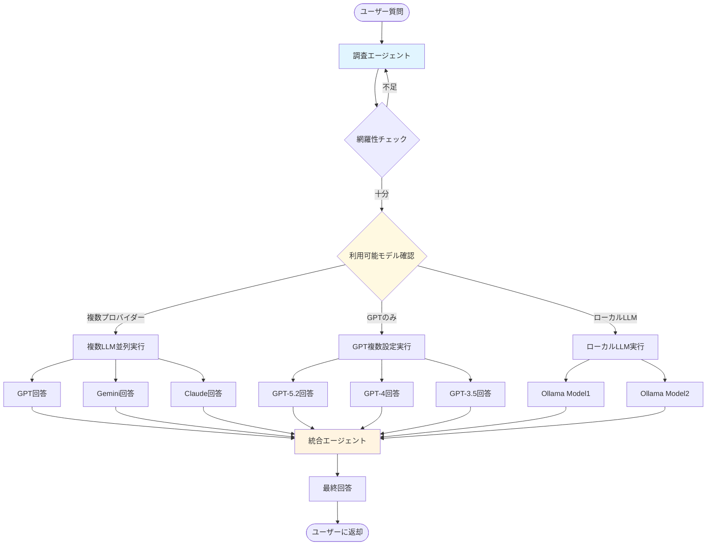

# マルチLLM統合エージェント設計

## アーキテクチャ概要

このエージェントは以下の3つの主要コンポーネントで構成されます：

1. **調査エージェント（Research Agent）**: 論文、DB、アプリを網羅的に調査
2. **回答生成エージェント（Response Generation Agent）**: 複数のLLMで並列回答生成（GPTのみでも動作）
3. **統合エージェント（Integration Agent）**: 複数の回答をハイブリッド方式で統合

## システムフロー




## 主要コンポーネント

### 1. 調査エージェント（`research_agent.py`）

**機能**:

- 論文検索（arXiv、PubMed、Google Scholar API）
- データベース検索（Web検索、専門DB）
- アプリケーション調査（GitHub、Stack Overflow、ドキュメント）

**網羅性評価**:

- 検索結果の多様性スコア
- 情報源のカバレッジ（論文/DB/アプリのバランス）
- 新規情報の発見率

**繰り返し制御**:

- カバレッジ閾値（デフォルト: 80%）に達するまで繰り返し
- 各イテレーションで未探索領域を特定
- 最大イテレーション数（デフォルト: 5回）で制限

### 2. LLM回答生成（`llm_agents.py`）

**柔軟な実行戦略**:

#### 複数プロバイダーがある場合:

- OpenAI API（GPT-5.2、GPT-5、GPT-4、GPT-3.5-turbo）
- Google Gemini API
- Anthropic Claude API
- ローカルLLM（Ollama、Transformers）

#### GPTのみの場合:

- 異なるモデルを使用（GPT-5.2、GPT-4、GPT-3.5-turbo）
- 異なるパラメータで複数回呼び出し（temperature: 0.3, 0.7, 1.0）
- 異なる視点のsystem prompt（保守的、革新的、実用的）

**各LLMへの入力**:

- ユーザーの質問
- 調査エージェントが収集した情報（コンテキスト）
- 回答形式の指示

### 3. 統合エージェント（`integration_agent.py`）

**ハイブリッド統合方式**:

1. **類似度分析**: 各回答間の意味的類似度を計算
2. **信頼度スコアリング**: 

- 回答の一貫性
- 根拠の明確さ
- 他のLLMとの一致度

3. **重み付け統合**: 信頼度に基づいて重み付け平均
4. **メタLLM統合**: 統合が困難な場合、メタLLMが最終統合を実行
5. **合意形成**: 重要な不一致がある場合、各LLMに再検討を促す

### 4. 安全なモデル検出（`utils/api_clients.py`）

**安全なモデル検出機能**:

- **キャッシュ機能**: モデルリストを24時間キャッシュ（`.model_cache.json`）
- **明示指定優先**: 設定ファイルで指定されたモデルのみ使用
- **全当たり探索なし**: 存在しないモデルは試行しない
- **エラーハンドリング**:
- 404（モデル不存在）: 即座にスキップ
- レート制限エラー: 適切な待機時間後に再試行
- 認証エラー: 即座に停止してエラー表示

**将来のモデル対応**:

- バージョン番号に依存しない設計（GPT-5.2、GPT-6、GPT-7などに対応）
- 正規表現パターンでモデル名を自動認識
- キャッシュで利用可能モデルを記録

## ファイル構成

```javascript
new_project/
├── requirements.txt              # 依存パッケージ
├── README.md                     # 使用方法
├── .model_cache.json             # モデルリストキャッシュ（自動生成）
├── .gitignore                    # キャッシュファイルを除外
├── config/
│   ├── __init__.py
│   └── settings.py              # APIキー、閾値設定、モデル設定
├── agents/
│   ├── __init__.py
│   ├── research_agent.py        # 調査エージェント
│   ├── llm_agents.py            # LLM回答生成
│   └── integration_agent.py    # 統合エージェント
├── utils/
│   ├── __init__.py
│   ├── coverage_evaluator.py    # 網羅性評価
│   ├── similarity.py            # 類似度計算
│   └── api_clients.py           # LLM APIクライアント（安全なモデル検出含む）
└── main.py                       # エントリーポイント
```


## 実装詳細

### 調査エージェントの網羅性評価

- **多様性スコア**: 検索結果のトピック分散度（TF-IDFベース）
- **カバレッジマップ**: 論文/DB/アプリの各領域での情報収集状況
- **ギャップ検出**: 未探索領域の特定と次回調査の優先順位付け

### 統合エージェントのハイブリッド方式

1. **第一段階**: 類似度分析で回答をクラスタリング
2. **第二段階**: 各クラスタの代表回答を信頼度で重み付け
3. **第三段階**: 不一致が大きい場合、メタLLMが統合を実行
4. **第四段階**: 必要に応じて合意形成プロセスを実行

### 安全なモデル検出の実装

**キャッシュ機能**:

```python
# 起動時または初回のみAPI呼び出し
# 結果を.model_cache.jsonに保存
# 24時間以内のキャッシュがあれば使用
```

**明示指定優先**:

```python
# 設定ファイルで指定されたモデルのみ使用
# 利用可能モデルリストと照合
# 存在しないモデルはスキップ（全当たりしない）
```

**エラーハンドリング**:

```python
# 404エラー: モデル不存在 → 即座にスキップ
# 429エラー: レート制限 → 待機して再試行
# 401エラー: 認証失敗 → 即座に停止
```


## 設定可能なパラメータ

### 基本設定

- 網羅性閾値（デフォルト: 80%）
- 最大調査イテレーション数（デフォルト: 5回）
- LLMの温度設定
- 統合方式の選択（重み付け/メタLLM/合意形成）
- 各LLMの信頼度重み

### LLM設定

- **APIモード/ローカルモード**: 切り替え可能
- **使用モデル**: 明示的に指定（例: `['gpt-5.2', 'gpt-4', 'gpt-3.5-turbo']`）
- **自動検出**: 無効化推奨（安全のため）
- **キャッシュ設定**: 有効/無効、キャッシュ期間
- **フォールバック戦略**: `use_first_available`（最初に見つかったもののみ）

### ローカルLLM設定

- **プロバイダー**: `ollama`, `transformers`, `llama_cpp`
- **ベースURL**: Ollamaのデフォルトは `http://localhost:11434`
- **使用モデル**: 例: `['llama3:8b', 'mistral:7b', 'phi3:mini']`

## 依存パッケージ

### API LLM

- `openai`: OpenAI API
- `google-generativeai`: Gemini API（オプション）
- `anthropic`: Claude API（オプション）

### ローカルLLM

- `ollama`: Ollamaクライアント（オプション）
- `transformers`: Hugging Face Transformers（オプション）
- `torch`: PyTorch（Transformers使用時）

### 共通

- `langchain`: LLM統合フレームワーク（オプション）
- `numpy`, `scikit-learn`: 類似度計算、クラスタリング
- `requests`: Web検索、API呼び出し
- `arxiv`: arXiv論文検索
- `scholarly`: Google Scholar検索（オプション）

## 使用例

### 基本使用（GPTのみ）

```python
from agents import MultiLLMAgent

agent = MultiLLMAgent()
response = agent.query(
    "量子コンピューティングの最新の進展について教えてください",
    coverage_threshold=0.8,
    max_iterations=5
)
```


### 設定ファイル例（GPTのみ）

```python
# config/settings.py
LLM_CONFIG = {
    'openai': {
        'enabled': True,
        'api_key': os.getenv('OPENAI_API_KEY'),
        'models': ['gpt-5.2', 'gpt-4', 'gpt-3.5-turbo'],
        'auto_discover': False,  # 安全のため無効化
        'fallback_strategy': 'use_first_available',
        'cache_models': True,
        'cache_duration_hours': 24
    },
    'gemini': {'enabled': False},
    'claude': {'enabled': False}
}
```


### ローカルLLM使用

```python
# config/settings.py
LLM_MODE = "local"
LOCAL_LLM_CONFIG = {
    "provider": "ollama",
    "models": ["llama3:8b", "mistral:7b", "phi3:mini"],
    "base_url": "http://localhost:11434"
}
```


## セキュリティとベストプラクティス

### Banリスク対策

- ✅ モデルリスト取得は起動時1回のみ（キャッシュ使用）
- ✅ 存在しないモデルは試行しない
- ✅ レート制限エラー時の適切な待機処理
- ✅ 明示的なモデル指定を優先

### コスト最適化

- ✅ キャッシュで不要なAPI呼び出しを削減
- ✅ モデル検証はオプション（デフォルト無効）
- ✅ エラー時の即座なスキップ

### 将来のモデル対応

- ✅ バージョン番号に依存しない設計
- ✅ 正規表現パターンでモデル名を自動認識
- ✅ キャッシュで利用可能モデルを記録

## 拡張可能性

- 追加のLLMプロバイダー対応
- カスタム調査ソースの追加
- 統合方式のプラグイン化